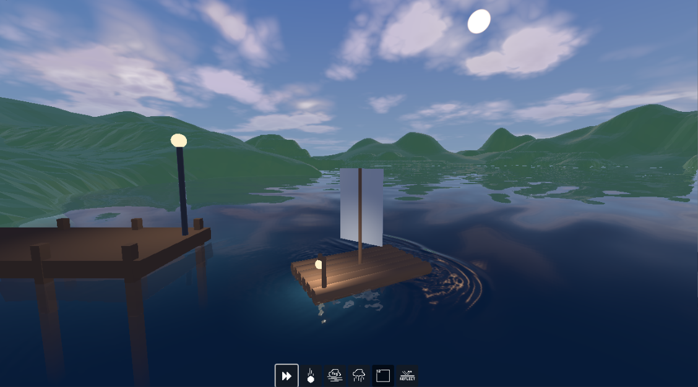
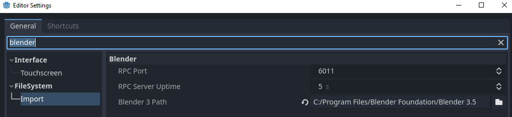
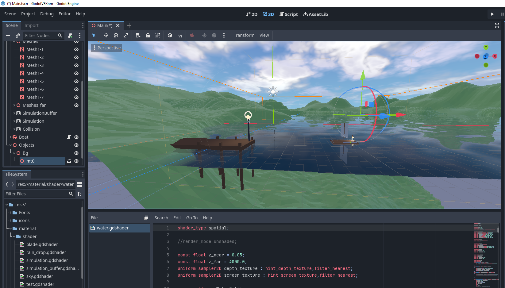

# 이것은 호수입니다.
- 완성된 게임(Windows, Andriod) : https://drive.google.com/drive/folders/1BHDHRbljeKXSZeiPwldDmfuKuaGNitom
- 핵심 기술 코드 : https://github.com/JyarlJung/GodotWaterShader

## 소개
모바일에서 사실적인 물 표면을 나타내기 위한 렌더링 모델과 이를 활용한 캐주얼 시뮬레이션 게임입니다.

구현된 기능 :
+ Screen Space Reflection
+ Fake Refraction
+ Proximity fade
+ Bump map
+ Normal Map
+ Texture base Splash Effect
+ Rain Effect(GPU Particle)

## 프로젝트 여는법

프로젝트 파일을 받은 후, 고도엔진 4.1.3(혹은 그 이상)에디터로 실행하면 됩니다. 블렌더 모델을 불러오기 위해서 에디터 설정-File System-Blender Path를 설정해주어야 합니다.

설정이 제대로 된 경우, 다음과 같이 프로젝트가 열립니다.

## Reference
+ https://github.com/JyarlJung/GodotWaterShader
+ https://github.com/marcelb/GodotSSRWater#what-is-this-about
+ https://github.com/CBerry22/Godot-Water-Ripple-Simulation-Shader
+ Godot Engine SSR source code
